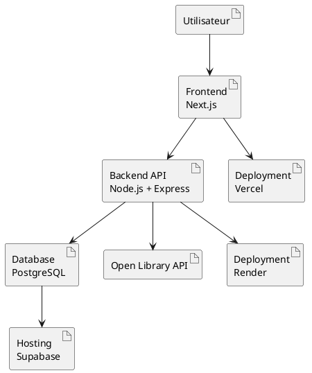

# Choix et justification de l'architecture et de la stack technique

BlaBlaBook repose sur une architecture client / serveur avec une séparation stricte entre le frontend, le backend et la base de données. Cette séparation permet l'indépendance des déploiements et une maintenance simplifiée.

---

## Vue d'ensemble de l'architecture

## Frontend — Next.js, Tailwind CSS, shadcn/ui

Le frontend est une Single Page Application (SPA) construite avec Next.js. Il communique avec le backend exclusivement via des appels HTTP à l'API REST.

Justification :

- **Next.js (React)** : Framework moderne offrant un routing intégré (App Router) et d'excellentes performances grâce au rendu hybride (Static/Server-side), facilitant ainsi le SEO.
- **Tailwind CSS** : Permet un développement rapide d'interfaces réactives (responsive) grâce à une approche par classes utilitaires, garantissant une maintenance aisée du design.
- **shadcn/ui** : Fournit des composants d'interface accessibles et hautement personnalisables, parfaitement intégrés à l'écosystème Tailwind.

---

## Backend — Node.js + Express (API REST)

Le backend expose une API REST stateless. Il reçoit les requêtes du frontend, applique la logique métier, vérifie les droits via un middleware d'authentification, puis interroge la base de données ou la Open Library API.

Justification :

- **Node.js & Express** : Un choix minimaliste et performant permettant de rester sur un écosystème fullstack JavaScript cohérent. Sa large documentation facilite le développement de routes API claires et prévisibles.
- **Zod** : Utilisé pour la validation rigoureuse des schémas de données en entrée, garantissant que l'API ne traite que des informations correctement formatées et sécurisées.
- **Organisation** : Le code est structuré par fonctionnalités (auth/, books/, library/) pour une meilleure lisibilité.

> Utilisateur → Frontend → API REST → AuthMiddleware → Controllers → Prisma → Base de données

---

## Authentification et sécurité

La sécurité des accès et la protection des données utilisateurs sont au coeur de l'architecture.

Justifications :

- **JWT (JSON Web Tokens)** : Permet une authentification stateless. Chaque requête est autonome, ce qui facilite la montée en charge du serveur.
- **argon2** : Assure le hachage sécurisé des mots de passe en base de données, protégeant les utilisateurs contre les fuites potentielles.

---

## Base de données - PostgreSQL via Supabase et Prisma

Le stockage des données utilisateur et des bibliothèques personnelles est assuré par une base PostgreSQL relationnelle, hébergée sur Supabase.

Justification :

- **PostgreSQL** : Un système de gestion de base de données robuste et éprouvé, idéal pour gérer les relations complexes entre les entités du projet.
- **Prisma (ORM)** : Garantit un typage fort et une sécurité accrue contre les injections SQL. Il simplifie également la gestion des migrations de schémas.
- **Supabase** : Fournit une instance PostgreSQL managée avec une interface d'administration intégrée, simplifiant la configuration réseau et la maintenance.

---

## API externe - Open Library API

Les données bibliographiques (titre, auteur, couverture, description…) ne sont pas stockées en base. Elles sont récupérées à la demande depuis la Open Library API, ce qui évite de maintenir un catalogue propriétaire.
Cela assure aux utilisateurs l'accès à une base de données mondiale et toujours à jour.

---

## DevOps et Déploiement

Pour garantir la stabilité entre les environnements de développement et de production, nous utilisons des outils de conteneurisation.

Justifications :

- **Docker** : Assure un environnement de développement reproductible pour toute l'équipe, éliminant les problèmes de "ça marche sur ma machine".
- **Eslint** : Utilisé pour harmoniser la qualité du code et détecter les erreurs potentielles dès la phase d'écriture.

## Table de déploiement

| Composant       | Service  | Justification                                            |
| --------------- | -------- | -------------------------------------------------------- |
| Frontend        | Vercel   | Optimisation native pour Next.js et déploiement continu. |
| Backend API     | Render   | Simplicité de déploiement pour les applications Node.js. |
| Base de données | Supabase | PostgreSQL managé et haute disponibilité.                |
| Versionning     | GitHub   | Collaboration et intégration des flux CI/CD.             |
