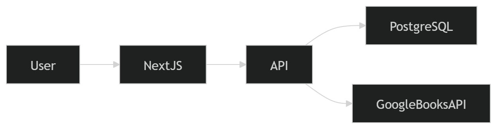
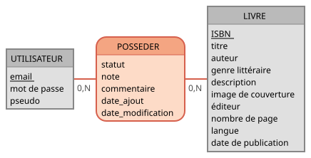

# Cahier des Charges - BlaBlaBook

**Projet** : BlaBlaBook - Application de gestion de bibliothèque personnelle
**Formation** : CDA (Concepteur Développeur d'Applications)
**Équipe** : Christopher, Ophélie, Paul, Rémi
**Version** : 1.0
**Dernière mise à jour** : 15 mars 2026

---

## 📑 Table des Matières

1. [Vision et Objectifs du Projet](#-1-vision-et-objectifs-du-projet)
2. [Public Cible](#-2-public-cible)
3. [Fonctionnalités Clés (MVP)](#-3-fonctionnalités-clés-mvp)
4. [Architecture Technique](#️-4-architecture-technique)
5. [Modèle de Données](#️-5-modèle-de-données)
6. [API Backend](#-6-api-backend)
7. [Interface Utilisateur](#-7-interface-utilisateur)
8. [Sécurité](#-8-sécurité)
9. [Organisation de l'Équipe](#-9-organisation-de-léquipe)
10. [Planning & Livrables](#-10-planning--livrables)
11. [Ressources et Références](#-11-ressources-et-références)
12. [Conventions et Standards](#-12-conventions-et-standards)

---

## 🎯 1. Vision et Objectifs du Projet

### 1.1 Vision

**BlaBlaBook** est une plateforme web permettant aux utilisateurs de :

- **Gérer leur bibliothèque personnelle** de manière centralisée et accessible partout
- **Rechercher des livres** par titre, auteur ou genre via l'API Open Library
- **Découvrir de nouveaux livres** adaptés à leurs goûts
- **Consulter des informations détaillées** sur les livres (couverture, résumé, auteur, éditeur)
- **Interagir avec une communauté de lecteurs** (fonctionnalité future)

BlaBlaBook s'inspire de plateformes comme **Babelio** ou **Goodreads**, en proposant une expérience plus **simple, moderne et centrée sur la lecture personnelle**.

### 1.2 Problématique

Les lecteurs n'ont pas d'outil **simple et centralisé** pour :

- **Suivre leurs lectures** : savoir ce qu'ils ont lu, ce qu'ils sont en train de lire, et ce qu'ils souhaitent lire
- **Retrouver des informations** sur un livre sans chercher sur plusieurs sites
- **Organiser leur bibliothèque** de façon numérique et accessible partout
- **Découvrir de nouveaux livres** selon leurs goûts sans être noyés dans des catalogues complexes

### 1.3 Solution Apportée

BlaBlaBook répond à ces problèmes en proposant :

✅ Un **système d'authentification** pour que chaque utilisateur dispose d'un espace personnel sécurisé

✅ Un **moteur de recherche** connecté à l'**Open Library API** pour accéder à un catalogue vaste et à jour

✅ Des **fiches détaillées** par livre (titre, auteur, résumé, couverture, éditeur, date)

✅ Une **bibliothèque personnelle** avec gestion des statuts de lecture : *à lire*, *en cours*, *lu*

✅ Des **fonctionnalités sociales** à terme : avis, notes, groupes de lecture, recommandations personnalisées

### 1.4 Objectifs Pédagogiques

Ce projet met en pratique :

- Le développement **fullstack** (Frontend Next.js + Backend Express)
- L'architecture **API REST**
- La gestion de projet **Agile** (méthode Scrum)
- La collaboration avec **Git/GitHub** (branches, PR, revue de code)

📖 **Documentation complète** : [1-Presentation/](1-Presentation/)

---

## 👥 2. Public Cible

### 2.1 Personas Principaux

**1. L'amateur de lecture passionné**

- **Profil** : Lit 20+ livres/an, suit des blogs littéraires
- **Besoin** : Organiser sa bibliothèque, noter ses lectures, retrouver facilement un livre lu
- **Comportement** : Utilise déjà Babelio ou Goodreads mais les trouve trop complexes

**2. Le lecteur occasionnel**

- **Profil** : Lit 5-10 livres/an, souvent des bestsellers ou recommandations d'amis
- **Besoin** : Garder une liste de livres à lire, ne pas oublier ce qu'il a aimé
- **Comportement** : Cherche une solution simple, rapide, sans fonctionnalités superflues

**3. L'étudiant / Le chercheur**

- **Profil** : Doit gérer des ouvrages académiques, prendre des notes
- **Besoin** : Classifier par thème, retrouver rapidement ses sources
- **Comportement** : Apprécie les outils numériques qui facilitent l'organisation

### 2.2 Besoins Identifiés

- 🔐 **Sécurité** : Données personnelles protégées
- 📱 **Accessibilité** : Interface responsive (mobile + desktop)
- ⚡ **Rapidité** : Recherche instantanée, navigation fluide
- 🎨 **Design** : Interface moderne, agréable, épurée
- 🌐 **Disponibilité** : Accessible 24/7 depuis n'importe où

📖 **Documentation complète** : [1-Presentation/3.cible-du-projet.md](1-Presentation/3.cible-du-projet.md)

---

## ⚡ 3. Fonctionnalités Clés (MVP)

Le **Minimum Viable Product (MVP)** est la version minimale du produit qui fonctionne de bout en bout, apporte une valeur utilisateur et peut être démontrée.

### 3.1 Bloc 1 - Authentification 🔐

L'utilisateur peut créer un compte, se connecter et se déconnecter.

**Fonctionnalités** :

- ✅ Inscription (email, mot de passe, nom d'utilisateur)
- ✅ Connexion (email, mot de passe) → retourne un **JWT**
- ✅ Déconnexion
- ✅ Stockage sécurisé des mots de passe avec **argon2**
- ✅ Sessions gérées par **JWT** (JSON Web Tokens)

---

### 3.2 Bloc 2 - Page d'Accueil 🏠

Point d'entrée de l'application.

**Fonctionnalités** :

- ✅ Présentation du projet
- ✅ Affichage de livres mis en avant (sélection aléatoire)
- ✅ Lien vers la recherche

---

### 3.3 Bloc 3 - Recherche de Livres 🔍

L'utilisateur peut rechercher un livre via l'**Open Library API**.

**Résultats affichés** :

- ✅ Titre
- ✅ Auteur
- ✅ Couverture
- ✅ Description courte

---

### 3.4 Bloc 4 - Fiche Détaillée d'un Livre 📖

En cliquant sur un résultat, l'utilisateur accède à la fiche complète.

**Informations affichées** :

- ✅ Titre
- ✅ Auteur
- ✅ Description complète
- ✅ Couverture
- ✅ Date de publication
- ✅ Éditeur
- ✅ Nombre de pages
- ✅ Langue

---

### 3.5 Bloc 5 - Bibliothèque Personnelle 📚

L'utilisateur connecté peut gérer ses lectures.

**Fonctionnalités** :

- ✅ **Ajouter** un livre à sa bibliothèque (depuis la fiche détail)
- ✅ **Voir** la liste de ses livres avec badges colorés pour les statuts
- ✅ **Modifier** le statut d'un livre : *à lire* / *en cours* / *lu*
- ✅ **Attribuer** une note (de 1 à 5 étoiles, optionnel)
- ✅ **Rédiger** un avis personnel (commentaire, optionnel)
- ✅ **Supprimer** un livre de sa bibliothèque (avec confirmation)

**Statuts de lecture** (Enum `ReadingStatus`) :

- `TO_READ` - À lire
- `READING` - En cours de lecture
- `READ` - Lu / Terminé

---

### 3.6 Bloc 6 - Modification du Profil Utilisateur 👤

L'utilisateur connecté peut mettre à jour ses informations personnelles.

**Fonctionnalités** :

- ✅ Modifier son nom d'utilisateur
- ✅ Changer son adresse email
- ✅ Modifier son mot de passe
- ✅ Validation et feedback visuel sur les modifications

---

### 3.7 Bloc 7 - Mentions Légales et Confidentialité ⚖️

Informations légales accessibles à tous les visiteurs.

**Contenu** :

- ✅ Page dédiée `/legal` accessible depuis le footer
- ✅ Mentions légales (créateur du site, hébergeur)
- ✅ Politique de confidentialité (collecte et utilisation des données)
- ✅ Lien présent dans le formulaire d'inscription

---

### 3.8 Évolutions Potentielles (Hors MVP)

Ces fonctionnalités sont prévues dans la roadmap mais ne feront pas partie de la version initiale :

**Version 2 - Interactions sociales**

- Voir les avis et notes d'autres utilisateurs
- Aimer ou commenter les avis
- Suivre d'autres utilisateurs
- Système de rôles (expertise sur les ouvrages)

**Version 3 - Recommandations et statistiques**

- Suggestions personnalisées
- Tableau de bord : statistiques de lecture, genres préférés

**Version 4 - Fonctionnalités communautaires**

- Bibliothèques publiques
- Groupes de lecture
- Chat entre membres

**Version 5 - Fonctionnalités avancées**

- Recherche filtrée (genre, date, note)
- Scan ISBN (via caméra)

📖 **Documentation complète** :

- [2-Fonctionnalites/1.MVP-fonctionnalites.md](2-Fonctionnalites/1.MVP-fonctionnalites.md)
- [2-Fonctionnalites/2.user-stories.md](2-Fonctionnalites/2.user-stories.md) (US-01 à US-13)
- [2-Fonctionnalites/4.backlog-items.md](2-Fonctionnalites/4.backlog-items.md)

---

## 🏗️ 4. Architecture Technique

### 4.1 Vue d'Ensemble

BlaBlaBook suit une architecture **client-serveur** classique avec séparation nette entre Frontend et Backend :

```plaintext
┌──────────────────────────────────────────────────────────────┐
│                        UTILISATEUR                           │
│                    (Navigateur Web)                          │
└────────────────────────────┬─────────────────────────────────┘
                             │
                             ▼
┌────────────────────────────────────────────────────────────┐
│                      FRONTEND                               │
│  Next.js 16 (App Router) + TypeScript + Tailwind CSS v4   │
│  - Pages : Home, Search, Library, Profile, Legal           │
│  - Composants UI : shadcn/ui                               │
│  - Gestion état : AuthContext (React Context)              │
└────────────────────────────┬───────────────────────────────┘
                             │ HTTP/HTTPS (API REST)
                             ▼
┌────────────────────────────────────────────────────────────┐
│                       BACKEND                               │
│        Node.js + Express + Prisma ORM + Zod                │
│  - Routes : /auth, /books, /library, /user                 │
│  - Middlewares : Auth JWT, Validation, Rate limiting       │
│  - Services : UserService, LibraryService, BookService     │
└────────────────────────────┬───────────────────────────────┘
                             │
              ┌──────────────┴──────────────┐
              ▼                             ▼
┌───────────────────────────┐  ┌───────────────────────────┐
│   BASE DE DONNÉES         │  │   API EXTERNE             │
│   PostgreSQL (Supabase)   │  │   Open Library API        │
│   - user                  │  │   Métadonnées de livres   │
│   - book                  │  │   Couvertures             │
│   - library_item          │  └───────────────────────────┘
└───────────────────────────┘
```

### 4.2 Schéma Architecture



### 4.3 Stack Technologique

| Couche               | Technologies                                       | Justification                                                                                                   |
| -------------------- | -------------------------------------------------- | --------------------------------------------------------------------------------------------------------------- |
| **Frontend**         | Next.js 16, TypeScript, Tailwind CSS v4, shadcn/ui | Framework React moderne avec routing intégré, SSR pour SEO, typage statique, développement rapide avec Tailwind |
| **Backend**          | Node.js, Express, Prisma ORM, Zod                  | JavaScript fullstack, API REST minimaliste, requêtes typées, validation robuste                                 |
| **Base de données**  | PostgreSQL (Neon)                                  | SGBD relationnel robuste, hébergement managé, protection contre injections SQL                                  |
| **Authentification** | JWT + argon2                                       | Sessions stateless, hachage sécurisé résistant aux attaques brute-force                                         |
| **API Externe**      | Open Library API                                   | Catalogue gratuit et à jour, évite de maintenir une base de livres propre                                       |
| **Déploiement**      | Vercel (frontend), Render (backend)                | Intégration native Next.js, déploiement automatique depuis GitHub                                               |
| **DevOps**           | Docker, GitHub Actions                             | Environnement identique pour tous les développeurs, CI/CD automatisé                                            |

📖 **Documentation complète** :

- [3-Architecture-Technique/1.choix-et-justifications.md](3-Architecture-Technique/1.choix-et-justifications.md)
- [3-Architecture-Technique/2.stack-technologies.md](3-Architecture-Technique/2.stack-technologies.md)
- [3-Architecture-Technique/diagrammes/](3-Architecture-Technique/diagrammes/)

---

## 🗄️ 5. Modèle de Données

### 5.1 Schéma Conceptuel (MCD)

Le modèle de données repose sur **3 entités principales** :

1. **USER** - Utilisateurs inscrits
2. **BOOK** - Catalogue de livres (issus de l'Open Library API)
3. **LIBRARY_ITEM** - Relation N:N entre USER et BOOK (bibliothèque personnelle)

**Relation** : `USER` **POSSEDE** (0,N) ↔ (0,N) `BOOK`
→ Implémentée via la table de liaison `LIBRARY_ITEM`



### 5.2 Tables Principales

#### Table : `user`

Stocke les informations des utilisateurs inscrits.

| Champ         | Type         | Contraintes      | Description                     |
| ------------- | ------------ | ---------------- | ------------------------------- |
| **id**        | UUID         | PRIMARY KEY      | Identifiant unique              |
| **email**     | VARCHAR(255) | UNIQUE, NOT NULL | Adresse email (connexion)       |
| **password**  | VARCHAR(255) | NOT NULL         | Mot de passe haché (argon2)     |
| **username**  | VARCHAR(100) | NOT NULL         | Nom d'utilisateur public        |
| **createdAt** | TIMESTAMP    | DEFAULT NOW      | Date de création du compte      |
| **updatedAt** | TIMESTAMP    | DEFAULT NOW      | Dernière modification du profil |

---

#### Table : `book`

Catalogue des livres issus de l'API Open Library.

| Champ             | Type         | Contraintes | Description                              |
| ----------------- | ------------ | ----------- | ---------------------------------------- |
| **id**            | UUID         | PRIMARY KEY | Identifiant unique interne               |
| **isbn**          | VARCHAR(20)  | -           | Numéro ISBN (optionnel)                  |
| **openLibraryId** | VARCHAR(100) | UNIQUE      | Identifiant Open Library (ex: OL123456W) |
| **title**         | VARCHAR(255) | NOT NULL    | Titre du livre                           |
| **author**        | VARCHAR(255) | -           | Auteur(s)                                |
| **genre**         | VARCHAR(100) | -           | Genre littéraire                         |
| **description**   | TEXT         | -           | Résumé du livre                          |
| **thumbnail**     | VARCHAR(512) | -           | URL de la couverture                     |
| **publisher**     | VARCHAR(512) | -           | Nom de l'éditeur                         |
| **pageCount**     | INTEGER      | -           | Nombre de pages                          |
| **language**      | VARCHAR(10)  | -           | Langue (code ISO : fr, en, es...)        |
| **publishedYear** | INTEGER      | -           | Année de publication                     |

---

#### Table : `library_item`

Table de liaison représentant la bibliothèque personnelle de chaque utilisateur.

| Champ         | Type          | Contraintes                 | Description                    |
| ------------- | ------------- | --------------------------- | ------------------------------ |
| **id**        | UUID          | PRIMARY KEY                 | Identifiant unique de l'entrée |
| **userId**    | UUID          | FK → user(id)               | Référence à l'utilisateur      |
| **bookId**    | UUID          | FK → book(id)               | Référence au livre             |
| **status**    | ReadingStatus | NOT NULL, DEFAULT 'TO_READ' | Statut de lecture              |
| **rating**    | INTEGER       | CHECK (1-5)                 | Note attribuée (1 à 5 étoiles) |
| **review**    | TEXT          | -                           | Avis personnel (optionnel)     |
| **createdAt** | TIMESTAMP     | DEFAULT NOW                 | Date d'ajout à la bibliothèque |
| **updatedAt** | TIMESTAMP     | DEFAULT NOW                 | Dernière modification          |

**Contraintes** :

- `UNIQUE (userId, bookId)` : Un utilisateur ne peut ajouter le même livre qu'une seule fois
- `ON DELETE CASCADE` : Suppression automatique si l'utilisateur ou le livre est supprimé

---

### 5.3 Type Enum : `ReadingStatus`

| Valeur    | Signification | Description                                  |
| --------- | ------------- | -------------------------------------------- |
| `TO_READ` | À lire        | Le livre est dans la liste des livres à lire |
| `READING` | En cours      | L'utilisateur est en train de lire ce livre  |
| `READ`    | Lu / Terminé  | L'utilisateur a terminé la lecture           |

📖 **Documentation complète** :

- [4-Base-de-Donnees/1.MCD.md](4-Base-de-Donnees/1.MCD.md) + [Diagramme SVG](4-Base-de-Donnees/1.MCD-Mocodo.svg)
- [4-Base-de-Donnees/2.MLD.md](4-Base-de-Donnees/2.MLD.md) + [Diagramme SVG](4-Base-de-Donnees/2.MLD-drawio.svg)
- [4-Base-de-Donnees/3.MPD.md](4-Base-de-Donnees/3.MPD.md)
- [4-Base-de-Donnees/4.create-tables.sql](4-Base-de-Donnees/4.create-tables.sql) (Script SQL exécutable)
- [4-Base-de-Donnees/5.dictionnaire-de-donnees.md](4-Base-de-Donnees/5.dictionnaire-de-donnees.md)

---

## 🔌 6. API Backend

### 6.1 Endpoints Principaux

L'API REST expose **15 routes** réparties en 4 catégories.

#### Authentification - `/auth`

| Méthode | Route            | Description                    | Auth requise |
| ------- | ---------------- | ------------------------------ | ------------ |
| `POST`  | `/auth/register` | Créer un compte utilisateur    | ❌ Non        |
| `POST`  | `/auth/login`    | Se connecter (retourne un JWT) | ❌ Non        |

**Exemple de requête** :

```json
POST /auth/register
{
  "email": "user@mail.com",
  "password": "password123",
  "username": "reader42"
}
```

---

#### Livres - `/books`

| Méthode | Route                   | Description                                | Auth requise |
| ------- | ----------------------- | ------------------------------------------ | ------------ |
| `GET`   | `/books/search?q=...`   | Rechercher des livres via Open Library API | ❌ Non        |
| `GET`   | `/books/:openLibraryId` | Récupérer le détail d'un livre             | ❌ Non        |

---

#### Bibliothèque - `/library`

| Méthode  | Route          | Description                                         | Auth requise |
| -------- | -------------- | --------------------------------------------------- | ------------ |
| `GET`    | `/library`     | Récupérer la bibliothèque de l'utilisateur connecté | ✅ Oui        |
| `POST`   | `/library`     | Ajouter un livre à la bibliothèque                  | ✅ Oui        |
| `PATCH`  | `/library/:id` | Modifier le statut de lecture d'un livre            | ✅ Oui        |
| `DELETE` | `/library/:id` | Supprimer un livre de la bibliothèque               | ✅ Oui        |

**Exemple de requête** :

```json
PATCH /library/abc123
{
  "status": "READ",
  "rating": 4,
  "review": "Excellent livre, très captivant !"
}
```

---

#### Utilisateur - `/user`

| Méthode | Route           | Description                         | Auth requise |
| ------- | --------------- | ----------------------------------- | ------------ |
| `PATCH` | `/user/profile` | Modifier les informations du profil | ✅ Oui        |

---

### 6.2 API Externe : Open Library

**Endpoint** : `https://openlibrary.org/search.json`

**Paramètres** :

- `q` : Terme de recherche (titre, auteur)
- `fields` : Champs à retourner (title, author_name, cover_i, etc.)

**Exemple** :

```plaintext
GET https://openlibrary.org/search.json?q=Harry+Potter&fields=title,author_name,cover_i
```

📖 **Documentation complète** :

- [5-API-Backend/1.liste-des-routes.md](5-API-Backend/1.liste-des-routes.md)
- [5-API-Backend/2.processus-connexion.png](5-API-Backend/2.processus-connexion.png) (Diagramme du processus JWT)
- [API Open Library](https://openlibrary.org/developers/api)

---

## 🎨 7. Interface Utilisateur

### 7.1 Charte Graphique : "L'Élégance Littéraire"

**Thème** : Sobre, moderne, et littéraire

#### Palette de Couleurs (Mode Clair)

| Rôle              | Couleur         | Code Hex  | Usage                                 |
| ----------------- | --------------- | --------- | ------------------------------------- |
| **Primaire**      | Indigo Profond  | `#3730A3` | Boutons principaux, en-têtes, accents |
| **Accent**        | Vieux Rose      | `#D4A5A5` | Boutons d'action (CTA), survols       |
| **Accent Alt.**   | Terracotta Doux | `#E2725B` | CTA secondaires                       |
| **Fond**          | Gris Perle      | `#F9FAFB` | Arrière-plan des pages                |
| **Texte**         | Anthracite      | `#1F2937` | Texte principal                       |
| **Texte Second.** | Gris Ardoise    | `#6B7280` | Texte secondaire, placeholders        |
| **Bordures**      | Gris Clair      | `#E5E7EB` | Séparateurs, contours                 |

#### Typographie

| Rôle            | Police           | Poids | Taille  | Usage                     |
| --------------- | ---------------- | ----- | ------- | ------------------------- |
| **Titres**      | Playfair Display | 600   | 32–48px | Titres de section, cartes |
| **Sous-titres** | Lora             | 500   | 20–24px | Sous-titres, en-têtes     |
| **Corps**       | Inter            | 400   | 14–16px | Texte principal           |
| **UI**          | Geist Sans       | 500   | 12–14px | Boutons, labels, menus    |
| **Code**        | JetBrains Mono   | 400   | 13px    | Blocs de code             |

---

### 7.2 Pages Principales (Frontend)

| Route       | Page                | Accès       | Description                                |
| ----------- | ------------------- | ----------- | ------------------------------------------ |
| `/`         | Page d'accueil      | Public      | Présentation + livres mis en avant         |
| `/login`    | Connexion           | Public      | Formulaire de connexion                    |
| `/register` | Inscription         | Public      | Formulaire d'inscription                   |
| `/search`   | Recherche de livres | Public      | Moteur de recherche Open Library           |
| `/book/:id` | Fiche détaillée     | Public      | Informations complètes sur un livre        |
| `/library`  | Ma bibliothèque     | Authentifié | Liste des livres de l'utilisateur          |
| `/profile`  | Mon profil          | Authentifié | Modification des informations personnelles |
| `/legal`    | Mentions légales    | Public      | Informations légales et confidentialité    |

---

### 7.3 Framework UI

**shadcn/ui** : Composants modernes et accessibles

- Cartes (BookCard)
- Boutons (Button)
- Formulaires (Input, Select, Textarea)
- Modales (Dialog)
- Badges (Badge pour les statuts de lecture)

📖 **Documentation complète** :

- [6-Interface-Utilisateur/1.navigateurs-compatibles.md](6-Interface-Utilisateur/1.navigateurs-compatibles.md)
- [6-Interface-Utilisateur/2.charte-graphique.md](6-Interface-Utilisateur/2.charte-graphique.md)
- [6-Interface-Utilisateur/wireframes/](6-Interface-Utilisateur/wireframes/) (7 pages desktop + mobile)
- [6-Interface-Utilisateur/maquettes/](6-Interface-Utilisateur/maquettes/) (9 pages desktop + mobile)

---

## 🔒 8. Sécurité

### 8.1 Mesures Critiques Implémentées

#### 1. Authentification Sécurisée

✅ **Hachage des mots de passe** : argon2 (résistant aux attaques brute-force)

✅ **Sessions stateless** : JWT (JSON Web Tokens)

✅ **Validation des tokens** : Middleware d'authentification sur toutes les routes protégées

✅ **Expiration des tokens** : Durée de vie limitée (ex : 24h)

---

#### 2. Validation des Données

✅ **Validation côté serveur** : Zod pour valider toutes les entrées utilisateur

✅ **Protection contre les injections SQL** : Prisma ORM (requêtes préparées)

✅ **Sanitisation des inputs** : Nettoyage des données avant traitement

**Exemple de schéma Zod** :

```typescript
const registerSchema = z.object({
  email: z.string().email(),
  password: z.string().min(8),
  username: z.string().min(3).max(50)
});
```

---

#### 3. Protection des Endpoints

✅ **Helmet.js** : Headers de sécurité HTTP (CSP, XSS, etc.)
✅ **CORS** : Configuration restrictive des origines autorisées
✅ **Rate Limiting** : express-rate-limit pour limiter les tentatives de connexion
✅ **HTTPS** : Toutes les communications chiffrées en production

---

#### 4. Conformité RGPD

✅ **Consentement explicite** : Acceptation des CGU lors de l'inscription
✅ **Droit à l'oubli** : Possibilité de supprimer son compte
✅ **Minimisation des données** : Collecte uniquement des données nécessaires
✅ **Transparence** : Page `/legal` détaillant l'utilisation des données

---

#### 5. Sécurité de l'API Externe

✅ **Validation des réponses** : Vérification des données provenant de l'Open Library API
✅ **Gestion des erreurs** : Pas de fuite d'informations sensibles dans les messages d'erreur
✅ **Cache côté serveur** : Réduction des appels API externes (limite les risques de DoS)

---

### 8.2 Risques Identifiés et Mitigations

| Risque                                | Impact   | Mitigation                                   |
| ------------------------------------- | -------- | -------------------------------------------- |
| **Injection SQL**                     | Critique | Prisma ORM + Requêtes préparées              |
| **XSS (Cross-Site Scripting)**        | Élevé    | Helmet.js + Sanitisation des inputs          |
| **CSRF (Cross-Site Request Forgery)** | Moyen    | Tokens CSRF + SameSite cookies               |
| **Brute Force**                       | Élevé    | Rate limiting + argon2 (lent par design)     |
| **Fuite de données**                  | Critique | HTTPS + Validation stricte + Logs sécurisés  |
| **Indisponibilité API externe**       | Moyen    | Cache serveur + Fallback sur données locales |

📖 **Analyse complète** : [7-Securite-et-Risques/1.analyse-des-risques.md](7-Securite-et-Risques/1.analyse-des-risques.md)

---

## 👥 9. Organisation de l'Équipe

### 9.1 Méthode Agile (Scrum)

L'équipe BlaBlaBook fonctionne en **mode Scrum**. Bien que chaque membre ait une spécialité technique, nous sommes tous des **"Développeurs"** au sens Scrum.

---

### 9.2 Rôles Scrum

#### Product Owner (PO) - **Rémi**

**Responsabilités** :

- Définit les **User Stories** (US-01 à US-13)
- Priorise les fonctionnalités selon les besoins utilisateurs
- Gère le **Product Backlog**
- S'assure que l'équipe travaille sur les tâches les plus importantes

**Dominante technique** : Responsable Recherche & Intégration API (Open Library API)

---

#### Scrum Master (SM) - **Paul**

**Responsabilités** :

- Aide l'équipe à supprimer les obstacles (blocages techniques ou organisationnels)
- Anime les rituels Scrum (Daily, Rétrospective)
- S'assure que la méthode Scrum est bien comprise et appliquée

**Dominante technique** : Responsable Bibliothèque & DevOps (Docker, Déploiement)

---

### 9.3 Développeurs (Équipe de Réalisation)

#### Lead Developer Backend - **Christopher**

**Périmètre** :

- Architecture API Express
- Schéma Prisma/PostgreSQL
- Sécurité (JWT, argon2)
- Validation (Zod)

**Responsabilité** : Garantir la robustesse et la sécurité des données

---

#### Lead Developer Frontend - **Ophélie**

**Périmètre** :

- Architecture Next.js
- Système de design (Tailwind/shadcn)
- Gestion de l'état (AuthContext)
- Interfaces responsives

**Responsabilité** : Garantir une interface fluide, accessible et responsive

---

### 9.4 Rituels Scrum

| Rituel                   | Fréquence      | Durée     | Objectif                                             |
| ------------------------ | -------------- | --------- | ---------------------------------------------------- |
| **Sprint Planning**      | Début de cycle | 1-2h      | Définir les objectifs du sprint                      |
| **Daily Scrum**          | Chaque matin   | 15-30 min | Synchroniser l'équipe (fait, à faire, blocages)      |
| **Sprint Review**        | Fin de cycle   | 1h        | Démonstration des fonctionnalités terminées          |
| **Sprint Retrospective** | Fin de cycle   | 1h        | Amélioration continue (ce qui a marché, à améliorer) |

---

### 9.5 Récapitulatif des Responsabilités

| Fonctionnalité      | Responsable (Lead) | Rôle Scrum     |
| ------------------- | ------------------ | -------------- |
| Vision & Priorités  | Rémi               | Product Owner  |
| Agilité & Process   | Paul               | Scrum Master   |
| Architecture API    | Christopher        | Lead Dev Back  |
| Interface & UX      | Ophélie            | Lead Dev Front |
| Déploiement / CI-CD | Paul               | Developer      |

📖 **Documentation complète** : [8-Organisation-Equipe/1.roles-des-developpeurs.md](8-Organisation-Equipe/1.roles-des-developpeurs.md)

---

## 📅 10. Planning & Livrables

### 10.1 Sprint 0 - Documentation (TERMINÉ ✅)

**Durée** : 2 semaines
**Objectif** : Cadrer le projet et préparer le développement

**Livrables** :

- ✅ Cahier des charges complet
- ✅ Maquettes (wireframes + maquettes haute fidélité)
- ✅ Architecture technique (diagrammes)
- ✅ Modèle de données (MCD, MLD, MPD, SQL)
- ✅ User Stories (US-01 à US-13)
- ✅ Backlog produit priorisé

---

### 10.2 Roadmap des Sprints (Prévisionnel)

| Sprint       | Durée      | Fonctionnalités Clés | Livrables                                              |
| ------------ | ---------- | -------------------- | ------------------------------------------------------ |
| **Sprint 1** | 2 semaines | Setup projet + Auth  | US-01, US-02 (Inscription, Connexion)                  |
| **Sprint 2** | 2 semaines | Recherche + API      | US-03, US-04 (Recherche, Fiche livre)                  |
| **Sprint 3** | 2 semaines | Bibliothèque         | US-05, US-06, US-07 (Ajout, Modification, Suppression) |
| **Sprint 4** | 2 semaines | Profil + Polish      | US-08 (Profil), Tests, Déploiement                     |

**Date de livraison prévue** : [À définir]

---

### 10.3 Définition of Done (DoD)

Une fonctionnalité est considérée comme "terminée" lorsque :

- ✅ Le code est écrit et fonctionne en local
- ✅ Les tests unitaires passent (couverture minimale 70%)
- ✅ La revue de code est validée (1 reviewer minimum)
- ✅ La documentation est à jour
- ✅ La fonctionnalité est déployée en staging
- ✅ Le Product Owner a validé la démo

---

## 🔗 11. Ressources et Références

### 11.1 Documentation Complète

📁 **Cahier des Charges Complet** : [docs/Cahier-des-Charges/](.)

**Index des dossiers** :

- [1-Presentation/](1-Presentation/) - Vision, besoins, cible
- [2-Fonctionnalites/](2-Fonctionnalites/) - MVP, User Stories, Backlog
- [3-Architecture-Technique/](3-Architecture-Technique/) - Stack, diagrammes
- [4-Base-de-Donnees/](4-Base-de-Donnees/) - MCD, MLD, MPD, SQL
- [5-API-Backend/](5-API-Backend/) - Routes, processus
- [6-Interface-Utilisateur/](6-Interface-Utilisateur/) - Charte, wireframes, maquettes
- [7-Securite-et-Risques/](7-Securite-et-Risques/) - Analyse de sécurité
- [8-Organisation-Equipe/](8-Organisation-Equipe/) - Rôles, rituels

---

### 11.2 Liens Externes

**API et Données** :

- [Open Library API](https://openlibrary.org/developers/api) - Documentation officielle
- [Open Library Covers](https://openlibrary.org/dev/docs/api/covers) - API des couvertures de livres

**Technologies** :

- [Next.js](https://nextjs.org/docs) - Documentation officielle
- [shadcn/ui](https://ui.shadcn.com/) - Composants UI
- [Prisma](https://www.prisma.io/docs) - ORM pour PostgreSQL
- [Zod](https://zod.dev/) - Validation de schémas TypeScript

**Sécurité** :

- [OWASP Top 10 2025](https://owasp.org/Top10/) - Risques de sécurité web
- [argon2](https://github.com/ranisalt/node-argon2) - Hachage de mots de passe

**Gestion de Projet** :

- [Dépôt GitHub](https://github.com/O-clock-Figueres/projet-blablabook-cda) - Code source et gestion de projet
- [Guide Git & GitHub](../Guide%20Git%20&%20GitHub/) - Conventions de l'équipe

---

## 📝 12. Conventions et Standards

### 12.1 Git & GitHub

**Convention de commits** : Conventional Commits

Format :

```plaintext
<type>(<scope>): <description>

Exemples :
- feat(auth): add login page
- fix(header): keep menu visible on scroll
- docs(readme): add setup instructions
```

**Types autorisés** : `feat`, `fix`, `docs`, `refactor`, `test`

**Convention de branches** :

```plaintext
<type>/<description-kebab-case>

Exemples :
- feature/user-login-page
- fix/header-overflow-mobile
- docs/api-authentication-guide
```

**Workflow** :

1. Jamais de commit directement sur `main`
2. Une tâche = une branche = une Pull Request
3. Revue de code obligatoire (1 reviewer minimum)
4. Squash and merge pour garder un historique propre

📖 **Guide complet** : [Guide Git & GitHub](../Guide%20Git%20&%20GitHub/)

---

### 12.2 Code

**TypeScript** :

- Typage strict activé (`strict: true`)
- Pas de `any` (utiliser `unknown` si nécessaire)
- Types exportés pour la réutilisation

**ESLint** :

- Configuration Next.js recommandée
- Règles personnalisées pour l'équipe

**Prettier** :

- Formatage automatique au commit (hook pre-commit)
- Configuration partagée

**Tests** :

- Couverture minimale : 70%
- Tests unitaires : Vitest
- Tests E2E : Playwright

---

### 12.3 Nommage

**Fichiers** :

- Composants React : PascalCase (`BookCard.tsx`)
- Utilitaires : kebab-case (`format-date.ts`)
- Routes API : kebab-case (`user-service.ts`)

**Variables et fonctions** :

- camelCase (`getUserById`, `isAuthenticated`)

**Constantes** :

- UPPER_SNAKE_CASE (`API_BASE_URL`, `MAX_RETRY`)

---

## 📊 Statistiques du Projet

- **Pages documentées** : 67 fichiers
- **User Stories** : 13 US (US-01 à US-13)
- **Routes API** : 15 endpoints
- **Tables BDD** : 3 tables (User, Book, LibraryItem)
- **Wireframes** : 7 pages × 2 versions (desktop/mobile)
- **Maquettes** : 9 pages × 2 versions (desktop/mobile)
- **Diagrammes** : 9 diagrammes (architecture, séquence, activité)

---

## ✅ Checklist de Démarrage Rapide

Avant de commencer à coder, vérifier que :

- [ ] J'ai lu ce cahier des charges
- [ ] Je connais mon rôle dans l'équipe
- [ ] J'ai accès au dépôt GitHub
- [ ] J'ai configuré mon environnement de développement (Docker, Node.js, PostgreSQL)
- [ ] J'ai lu les conventions de code et de commits
- [ ] Je connais les User Stories prioritaires du prochain sprint
- [ ] J'ai consulté les maquettes et wireframes

---

**Document maintenu par l'équipe BlaBlaBook - CDA 2026** 📚✨

**Version** : 1.0
**Dernière mise à jour** : 15 mars 2026
**Équipe** : Christopher (Lead Dev Backend), Ophélie (Lead Dev Frontend), Paul (Scrum Master), Rémi (Product Owner)
