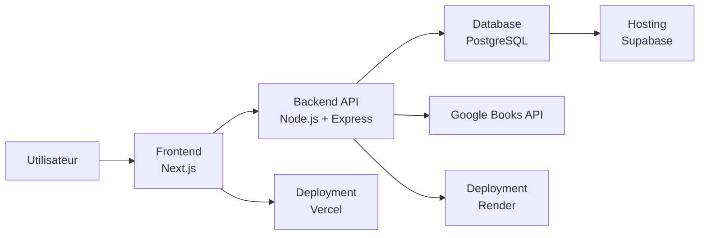

# Stack technique & Décisions

## Vue d'ensemble

BlaBlaBook est une application **fullstack web** composée de trois parties principales :

1. **Frontend**
2. **Backend API**
3. **Base de données**

Une API externe est utilisée pour récupérer les informations des livres.

---
<!-- TODO: A transformer en diagramme UML -->

---

## Eslint

TODO : A finaliser
Pourquoi ?

- Harmoniser le code et faciliter le travail d'équipe
-
-

## Frontend

### Next.js

Pourquoi ?

- framework React moderne
- routing intégré
- optimisé SEO
- très utilisé en production

---

### Tailwind CSS

Pourquoi ?

- développement rapide
- responsive simple
- utilitaire et maintenable

---

### shadcn/ui

Pourquoi ?

- composants UI modernes
- intégration facile avec Tailwind
- accessibilité intégrée

---

## Backend

### Node.js

Pourquoi ?

- JavaScript fullstack
- rapide à apprendre
- large écosystème

---

### Express

Pourquoi ?

- minimaliste
- facile pour créer une API REST
- très documenté

---

## Base de données

### PostgreSQL

Pourquoi ?

- robuste
- relationnel
- très utilisé dans les applications web

---

### Prisma

Pourquoi ?

- ORM moderne
- typage fort
- migrations simples
- intégration excellente avec Node.js

---

## Authentification

### JWT

Pourquoi ?

- stateless
- facile à utiliser avec API REST

---

### `bcrypt` & `argon2`

Pourquoi ?

- hash sécurisé des mots de passe

---

### Zod

Pourquoi ?

- validation des données
- sécurisation des inputs

---

## DevOps

### Docker

Pourquoi ?

- environnement reproductible
- simplifie la configuration pour toute l'équipe

---

### Vercel

Pourquoi ?

- déploiement simple pour Next.js

---

### Render

Pourquoi ?

- déploiement simple pour API Node.js

---

### Supabase

Pourquoi ?

- PostgreSQL managé
- facile à connecter

---
