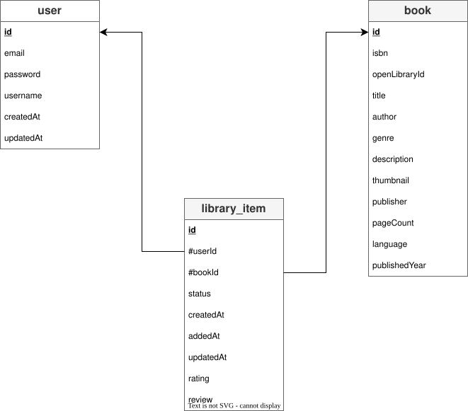

# MLD - Modèle Logique de Données

Le **Modèle Logique de Données** (MLD) est la traduction technique du MCD. A cette étape, les relations "plusieurs-à-plusieurs" (comme celle entre les utilisateurs et les livres) sont transformées en tables de jointure. Les cardinalités deviennent des clés étrangères (FK).

Le passage du MCD au **MLD (Modèle Logique de Données)** consiste à transformer les entités en tables et les associations de type "plusieurs-à-plusieurs" (0,N - 0,N) en tables de liaison (tables pivot).

---

## USER

- **id** (UUID, PK) : Identifiant unique
- **email** (VARCHAR, Unique) : Adresse de connexion
- **password** (VARCHAR) : Mot de passe haché
- **username** (VARCHAR) : Pseudo
- **createdAt** (DATETIME) : Date d'inscription
- **updatedAt** (DATETIME) : Date de modification

---

## BOOK

- **id** (UUID, PK) : Identifiant interne
- **ISBN** (VARCHAR) : Numéro international normalisé du livre
- **openLibraryId** (VARCHAR, Unique) : Identifiant provenant de l'API Open Library Books
- **title** (VARCHAR) : Titre de l'ouvrage
- **author** (VARCHAR) : Auteur(s)
- **genre** (VARCHAR) : Genre littéraire (Fiction, Science-fiction, Histoire, ...)
- **description** (TEXT) : Résumé du livre
- **thumbnail** (VARCHAR) : URL de l'image de couverture
- **publisher** (VARCHAR) : Editeur
- **pageCount** (INT) : Nombre de pages
- **language** (VARCHAR) : Langue du livre (ex : fr, en, es, ...)
- **publishedYear** (INT) : Année de parution

## LIBRARY_ITEM

- **id** (UUID, PK) : Identifiant unique de l'entrée dans la bibliothèque
- **#userId** (UUID, FK → USER.id) : Référence à l'utilisateur propriétaire du livre
- **#bookId** (UUID, FK → BOOK.id) : Référence au livre concerné
- **status** enum('TO_READ', 'READING', 'READ') : Etat du livre dans la bibliothèque (A lire, En cours, Lu)
- **addedAt** (DATETIME) : Date et heure d'ajout du livre à la bibliothèque
- **updatedAt** (DATETIME) : Date et heure de dernière mise à jour de l'entrée (ex : changement de statut)
- **rating** (INT, Optionnel) : Note attribuée par l'utilisateur (ex : de 1 à 5).
- **review** (TEXT, Optionnel) : Commentaire ou avis personnel sur le livre.

