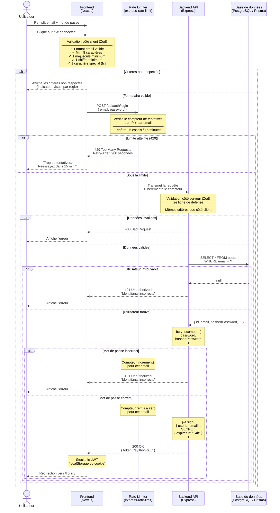

# Diagramme de séquence — Connexion utilisateur

**Fonctionnalité :** US-02 — Se connecter
**Acteurs impliqués :** Utilisateur · Frontend (Next.js) · Rate Limiter · Backend (Express) · Base de données (PostgreSQL/Prisma)
**Outils de sécurité :** Zod · bcrypt · JWT · express-rate-limit

---

## Le diagramme

---

## Explication pas à pas

### Les acteurs (les colonnes)

Chaque colonne verticale avec une ligne pointillée vers le bas s'appelle une **lifeline** (ligne de vie).

| Acteur | Rôle |
|--------|------|
| **Utilisateur** | La vraie personne devant l'écran |
| **Frontend (Next.js)** | Le code React qui s'exécute dans le navigateur |
| **Rate Limiter** | Un middleware Express qui surveille le nombre de tentatives |
| **Backend API (Express)** | Le serveur Node.js qui traite la logique métier |
| **Base de données (PostgreSQL/Prisma)** | Là où les données sont stockées en permanence |

---

### Les flèches

- `A ->> B` : flèche pleine → **requête / action** (A envoie quelque chose à B)
- `A -->> B` : flèche pointillée → **réponse** (B répond à A)

Le temps s'écoule **de haut en bas**.

---